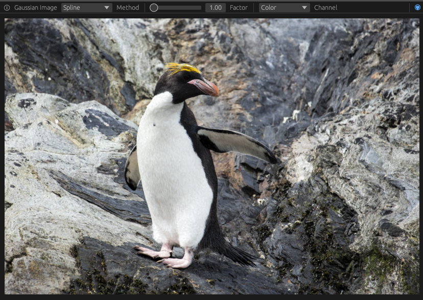

<div align="center">


</div>


# Gaussian Image Visualizer

[👉 Click to run the web viewer 👈](https://keksboter.github.io/gaussian_image)

This interactive viewer allows you to view [GaussianImages](https://github.com/Xinjie-Q/GaussianImage) in your brower in real-time. The Gaussians are rasterized on the fly each frame using the GPU (WebGPU).



## What is the Upscaling?

I created this viewer to visualize and experiment with different image upscaling techniques for Gaussian Images.


[In particular, our method for upscaling Gaussian images with analytical gradients.](https://keksboter.github.io/upscale3dgs/)

But the viewer can of course also be used simply to display Gaussian Images.

## Converting Files

Currently only the uncompressed version of GaussianImage is supported.
You need to convert the `gaussian_model.pth.tar`generated during traning into a `.npz` file:
```bash
python convert.py <model.pth.tar> <img_width> <img_height> <out_file>
```
Here `img_width` and `img_height` is the width and height of the original image. It is needed since the scaling vectors are relative to the resolution.

Example:
```bash
python convert.py gaussian_model.pth.tar 1200 800 model.npz
```

## Running the native viewer

The viewer can also be run natively on your desktop. 
Install rust and you are ready to go:
```
cargo run --bin viewer <model.npz>
```